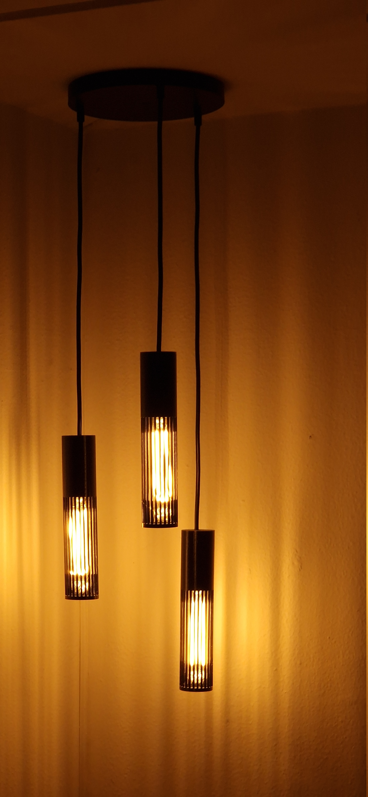

<a href="https://www.buymeacoffee.com/slimcdk"></a>


# Hanging lights [Work in progress]

Collections of slender lights hanging from ceiling. Base plate has room for Shelly Dimmer for easy brightness control.
<p align="center">
    
    
</p>


## Parts
* 1x Shelly Dimmer
* 3x WAGO terminals
* 3m nice looking wire 6-10mm
* 3x E27 sockets
* 1-3x M3 self-taping screws for mounting

<p align="center">
    
    
</p>


## Print guide

In progress.


## Assembly guide

> [!CAUTION]
:skull: **MAINS VOLTAGE** *Don't proceed if you aren't comftable with wiring mains voltage.*


## Contribution

Clone repository and fetch submodules

```bash
$ git clone --recursive-submodules git@github.com:slimcdk/hanging-lights.git
```

---

## Software uses

* https://www.freecadweb.org/
* https://github.com/features/actions
    * https://github.com/INTI-CMNB/KiBot
* https://code.visualstudio.com/
    * https://marketplace.visualstudio.com/items?itemName=ms-vscode-remote.remote-containers
* https://grabcad.com/library/shelly-dimmer-2-1
    * https://grabcad.com/valentin.gurgu-1